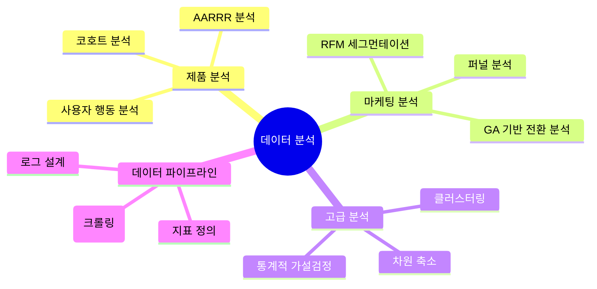

📊 데이터로 말하고, 인사이트로 성장하는 데이터 분석가 박준혁입니다.  
지표를 정의하고 사용자 행동을 분석해, 더 나은 의사결정을 도출하는 데 열정을 가지고 있습니다.

---

## 🗣 콘텐츠 & 브랜딩 활동

- **📰 Instagram 카드 뉴스 운영 – [@proddecoded](https://www.instagram.com/proddecoded/)**  
  → 제품 지표, 유저 여정, 리텐션 전략 등 **프로덕트 데이터 분석**을 주제로 카드 뉴스 콘텐츠 발행  
  → 데이터를 제품 성장에 연결하는 인사이트를 누구나 쉽게 이해할 수 있게 전달합니다.

- **📘 회고 블로그 – [data-d-luffy.tistory.com](https://data-d-luffy.tistory.com/)**  
  → 프로젝트, 공모전, 분석 실습 등을 회고 중심으로 기록  
  → “왜 이 분석을 했는가?”부터 시작해 문제 정의 → 분석 흐름 → 인사이트 도출까지 전 과정 설명

- **💼 LinkedIn – [박준혁 / Junhyeok Park](https://www.linkedin.com/in/%EC%A4%80%ED%98%81-%EB%B0%95-576391241/)**  

---

## 🔧 Tech Stack & Core Skills

> 단순한 기술 나열이 아닌, **문제를 해결하기 위한 도구**로서의 기술을 익혔습니다.  
> 분석가의 본질은 **행동을 읽고 설계하는 힘**이라고 믿습니다.

---
### 📊 데이터 분석 도구 (Tools)

<!-- 언어 및 분석 -->

<!-- 시각화 -->

<!-- 데이터 처리 및 클라우드 -->

---

### 📈 분석 경험 및 전문 역량 (Skills)

- **로그 분석**  
  → 10대 대상 익명 질문 SNS에서 **50만명 이상의 유저 로그 데이터**를 분석  
  → 클릭 행동, 초성 확인, 포인트 사용 등 이벤트 기반 흐름 분석을 통해 전환 유도 전략 도출

- **리텐션 & 전환율 분석**  
  → AARRR 퍼널 및 코호트 분석을 기반으로 활성/이탈 유저를 분류하고, 전환 병목 지점 개선 전략 수립

- **질문 추천 시스템 설계**  
  → 친구 기반 행동 분석, 시간대 최적화, 카테고리 다양성 보장 로직을 포함한 추천 알고리즘 설계  
  → RAG 구조 기반으로 유사 질문 생성 및 LLM을 활용한 추천 이유 설명 자동화

---

### 🤝 협업 및 문서화

---

## 🧠 분석 전문 영역

---

## 🔍 주요 프로젝트 경험

| 프로젝트 | 기술 요소 | 주요 내용 |
|----------|-----------|-----------|
| 🎯 LH 공모전 : 지식산업센터 공실률 최적화  | QGIS, Python | 공간 데이터 기반 유동인구 및 공실률 분석 |
| 🧠 RAG 기반 질문 추천기 | LangChain, FAISS, Gemini | 친구 행동 기반 + 카테고리 다양성 + 시간대 최적화 |
| 📈 10대 SNS 분석 | 로그, 퍼널 | 전환 유도 질문 패턴 도출 및 추천 알고리즘 설계 |
| 💡 사용자 분석 대시보드 | Tableau, BQ | AARRR 기반 사용자 여정 시각화 및 지표 설계 |
| RAG,LLM파인튜닝을 통한 컴퓨터 견적 추천 챗봇 | LangChain,chatgpt,Flask,React | selfquery리트리버로 사용자에 맞는 최적의 실시간 컴퓨터 견적 추천 챗봇 구현 |

---

## 🧠 직무 역량 요약

| 역량 | 상세 설명 |
|------|-----------|
| 📌 분석 설계 | AARRR, 코호트 분석, 퍼널 정의 |
| 🔬 통계/실험 | 가설 검정, A/B 테스트 설계 |
| 🛠 엔지니어링 | Airflow, BQ 기반 데이터 파이프라인 구축 |
| 🧠 머신러닝 | sklearn 기반 분류, 차원 축소, 클러스터링 |
| 💡 문제 해결력 | 이탈/전환 문제 정의 → 인사이트 도출 → 전략 제시 |

---

## 🎓 교육 및 활동

- **상명대학교 소프트웨어학과 졸업 (2019.03 ~ 2025.02)** / GPA 3.81  
- **Codeit AI 데이터 분석 부트캠프 4기 (2024.10 ~ 2025.05)**  
- **BDA 학회 활동 (2025.01 ~ 09)** – 통계반 수료, 사용자 분석반 활동 중

---

## 📜 자격증

- ADSP (2024.09)
- 빅데이터 분석기사 필기 (2025.04)
- SQLD 준비 중
- 빅데이터 분석기사 실기 준비 중

---

## 📨 Contact

언제든지 편하게 연락주세요. 커리어, 협업, 프로젝트 등 다양한 이야기를 나눌 준비가 되어 있습니다. 😊

### 📧 Email  
**pjh0000703@gmail.com**

### 📱 기타 연락처 및 채널

- 📞 Phone: **010-7681-3688**
- 📝 Blog: [https://data-d-luffy.tistory.com](https://data-d-luffy.tistory.com)
- 🧑‍💻 GitHub: [https://github.com/junhyeok0703](https://github.com/junhyeok0703)
- 📸 Instagram: [@proddecoded](https://www.instagram.com/proddecoded/)
- 💼 LinkedIn: [박준혁](https://www.linkedin.com/in/%EC%A4%80%ED%98%81-%EB%B0%95-576391241/)

---

