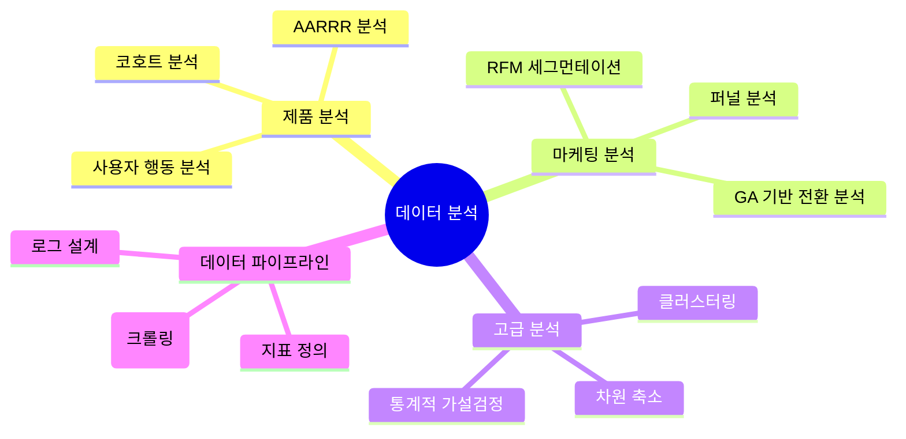

# 💫 About Me

안녕하세요! 데이터 분석가 박준혁입니다.  
"데이터로 말하고 인사이트로 성장하자" 라는 모토로 데이터분석을 하고있습니다

# 🎯 분석 전문 영역

# 🛠️ 기술 스택

## 📊 분석 도구

## 💻 개발 도구

## 🤝 협업 도구

# 📈 주요 분석 역량

| 분야 | 기술 |
|:---:|---|
| **사용자 행동 분석** | AARRR 기반 제품 분석 / 코호트 분석 / RFM 세그먼테이션 |
| **고급 분석** | 클러스터링 / 차원 축소 / 통계적 가설검정 / A/B 테스트 |
| **제품 분석** | 핵심 지표 설계 / 로그 설계 / 대시보드 구축 |
| **웹 분석** | GA4 구현 / 전환 추적 / 사용자 여정 분석 |

# 🔍 프로젝트 & 포트폴리오

