# 💫 About Me

안녕하세요! 데이터 분석가 박준혁입니다.  
"데이터로 말하고 인사이트로 성장하자" 라는 모토로 데이터분석을 하고있습니다

# 🎯 분석 전문 영역

```mermaid
mindmap
  root((데이터 분석))
    제품 분석
        사용자 행동 분석
        AARRR 분석
        코호트 분석
    마케팅 분석
        RFM 세그먼테이션
        GA 기반 전환 분석
        퍼널 분석
    고급 분석
        클러스터링
        차원 축소
        통계적 가설검정
    데이터 파이프라인
        로그 설계
        지표 정의
        자동화(크롤링)
```

# 🛠️ 기술 스택

## 📊 분석 도구

## 💻 개발 도구

## 🤝 협업 도구

# 📈 주요 분석 역량

| 분야 | 기술 |
|:---:|---|
| **사용자 행동 분석** | AARRR 기반 제품 분석 / 코호트 분석 / RFM 세그먼테이션 |
| **고급 분석** | 클러스터링 / 차원 축소 / 통계적 가설검정 / A/B 테스트 |
| **제품 분석** | 핵심 지표 설계 / 로그 설계 / 대시보드 구축 |
| **웹 분석** | GA4 구현 / 전환 추적 / 사용자 여정 분석 |

# 🔍 프로젝트 & 포트폴리오

# 📝 저장소 관리 원칙
> 체계적인 프로젝트 관리와 협업을 위한 가이드라인

* 프로젝트/스터디별 독립 저장소 운영
* 상세한 커밋 메시지 작성
  * 수정 내용
  * 수정 이유
  * 영향 범위
* README 필수 포함 사항
  * 프로젝트 개요 및 목표
  * 사용 기술 및 방법론
  * 주요 발견 및 결과
  * 실행 방법 및 환경 설정

